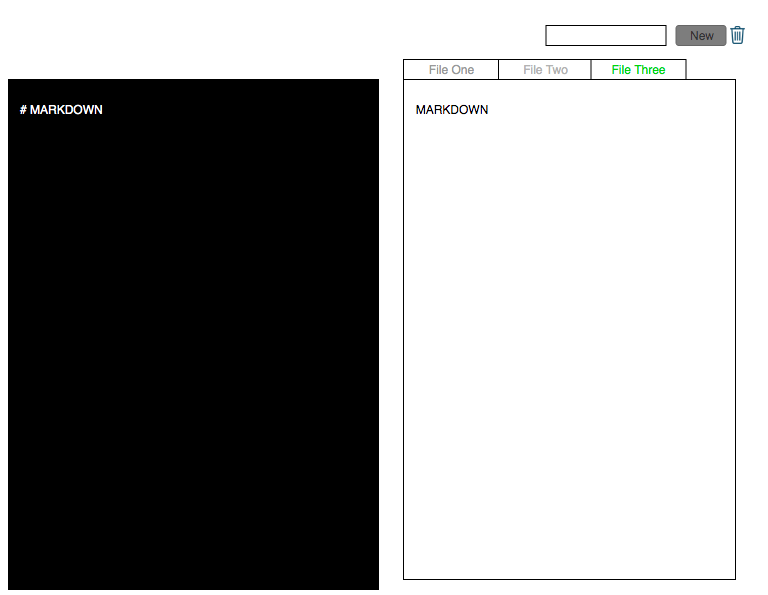

# Markdownly

We currently have a markdown editor that allows our customers to edit markdown
files and see a preview. The editor is becoming more popular and we have several
feature requests asking us to allow users to edit multiple markdown files at once.
Think the sheets 3in Google sheets or excel.

**For clarification see the Customer Success Team.**

Further, we are nearing the end of our funding runway and are about to start demoing
for some venture capitalist next week. We want this new feature to be part of that
demo, but to prevent any mishaps we are going to freeze new feature development in
48 hours. This means we need to complete this feature in the next 48 hours.

## Flow

* All code must be reviewed by a Senior Software Engineer (TAs).
* Project Managers (TAs) will add new cards to your Trello board as you progress.
* Plan out how you will accomplish each task
  * create Checklists (Part of the Trello cards)
  * ask for clarification
* Add new cards as needed (e.g. Bugs) and label them

## Mockup

Components

  Form - will handle adding new Tabs
  Tabs - will render Tabs
  Tab - will include name of display you want to view, handleClick func to switch the specific view and a button to delete the tab

Containers
  Header - Contain the Form and Tabs Components will handle logic renderting the tabs
  Main - will handle logic to switch between display
